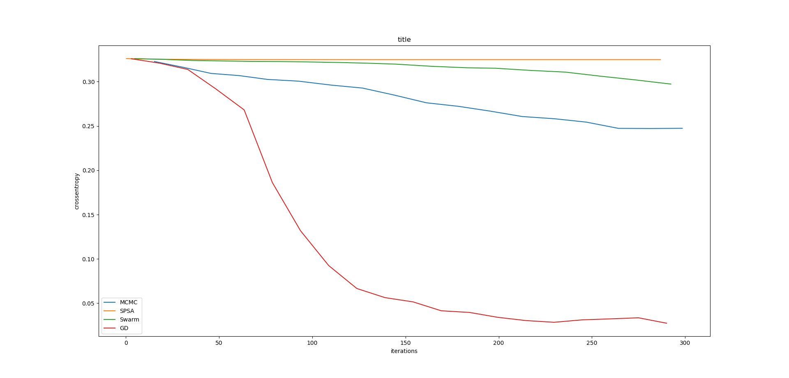
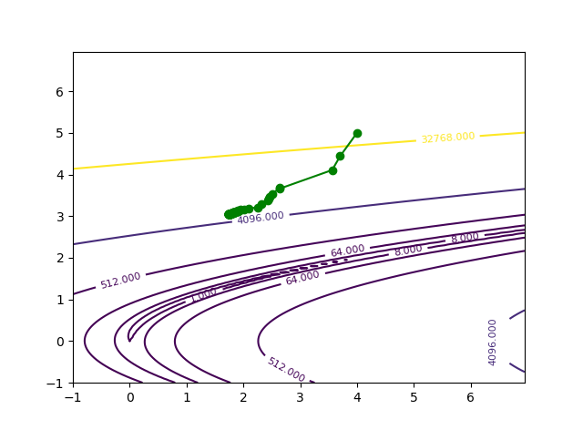

<h1>PyToolOptimizer</h1>

This project is a tool to help searchers in Optimization to code exciting new optimizer ! 

You can use any part or all this project to help you to implement new optimizer or new function to minimize. It's especially handsome in Deep Learning field because our tool abstracts complexity of the Deep Learning framework Tensorflow.

<h2>Why this framework is usefull ?</h2>
The use of this framework is particularly recommended in the Deep Learning field where optimizer are difficult to implement. This framework proposes to abstract this complexity. The forward and gradient descent are computed in GPU and the optimization is partially written in Python.
You can try your optimizer on other function, like 2D functions. Our framework allow you to display path in 1D or 2D functions.

<h2>How to use it ?</h2>
The usage is very simple :

```Python
from function_to_min import *
from optimizer import *

function_to_min = Rosenbrock()
optimizer = MCMC()
x=np.random.uniform(-1,+1,(2,))
x_n=optimizer.run_on_step(x,function_to_min)
```

x_n contains the new position point. So you can iterate on the last line to find a better position. <br/>

<p>
More examples here :
<ul>
  <li> <b>simple.py</b> to a complete example</li>
  <li> <b>bench.py test</b> many strategies as Deep Learning optimizer </li>
</ul>
</p>

<h2>Use case</h2>

<h3> Use case 1 : compare different Deep Learning optimizer </h3>
<b> bench.py </b>


<h3> Use case 2 : show SPSA optimizer on Rosenbrock 2D function </h3>
<b> bench.py </b>


<h3> Use case 3 : compare MCMC and SGD on cosinusoidal 1D function </h3>
<b></b>

